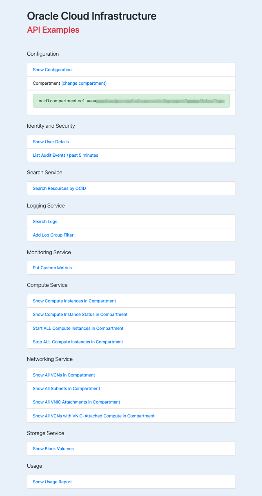

# OCI API Examples 

## [Oracle Cloud Infrastructure](https://www.oracle.com/cloud/)

[Python API](https://docs.oracle.com/en-us/iaas/tools/python/latest)

This example code will get you started with the OCI Python API. 

### API Clients In Use

- Audit
- Identity
- Compute
- Block Storage
- Virtual Networking
- Resource Search
- Log Search
- Monitoring / Put Custom Metrics
- Usage

### Prerequisites

You will need an OCI tenancy.  Check out the [OCI Cloud Free Tier](https://www.oracle.com/cloud/free/)!

See the [instructions](https://docs.oracle.com/en-us/iaas/tools/python/latest) for setting up API access to your tenancy.

This is a good article describing key [OCI concepts](https://blogs.oracle.com/developers/post/introduction-to-the-key-concepts-of-oracle-cloud-infrastructure).

You will need a OCI Compartment ID (aka, OCID) to run the app.  Compartments provide the IAM security scope for all API calls.  

### Virtual Environment

Set up a proper virtual env, activate it, and install the requirements in your virtual env:

    my-machine $ python3 -m venv venv
    my-machine $ source venv/bin/activate
    (venv) my-machine $ pip install -r requirements.txt

### Start the Flask web server:

    (venv) my-machine $ source start_server.sh
     * Serving Flask app "app/views.py" (lazy loading)
     * Environment: development
     * Debug mode: on
     * Running on http://127.0.0.1:5000/ (Press CTRL+C to quit)
     * Restarting with stat
     * Debugger is active!

### Access from local browser:

    http://127.0.0.1:5000/

# User Interface

